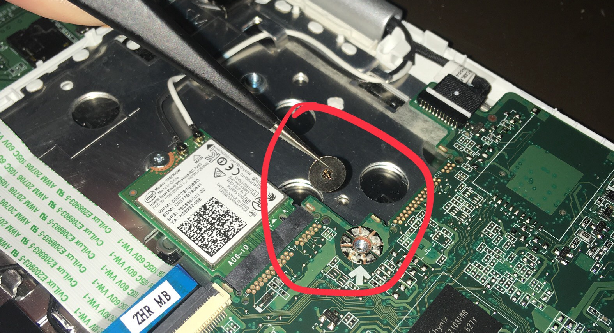
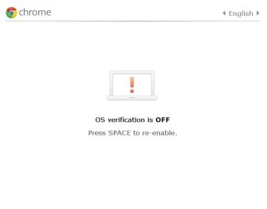

# Chromebook Setup

Chromebooks come pre-installed with Chrome OS, which is not very developer friendly. To circumnavigate this issue, linux is installed on chromebooks so both staff and students can use them.

PiE currently has 5 Acer R11 Chromebooks (CB5-132T). These chromebooks have baytrail cpu architecture. Linux can be installed on these computers using a script written by MrChromebox. For more information on the options available, visit their [site.](https://www.mrchromebox.tech)

## Pre-requisites
### Enable Developer Mode
Each chromebook has a slightly different way of enabling developer mode. In general, the most common way is to hit "Esc + refresh + power". Then, turn off OS verification and wait for the changes to take place (could take a while)
### Removing the hardware lock screw
This screw only needs to be removed for certain linux installations (see below). The location is different in different chromebooks. In the Acer R11, unscrew the back panel and remove the big screw with the white arrow.

## 

## Installation

There are three options for installing linux onto a chromebook:
1. Dual-boot linux with chrome os, but have chrome os boot first
2. Dual-boot linux with chrome os, but have linux boot first
3. Install a linux vm ontop of chrome os

### Dual-boot linux with chrome os, but have chrome os boot first (**NOT IDEAL**)

This method is the most easy to revert and relatively less involved. The steps include:
1. Turn off os-verification/enable developer mode in chrome os.
2. Open a terminal, type `shell` and hit enter
3. Copy and paste `cd; curl -LO https://mrchromebox.tech/firmware-util.sh && sudo bash firmware-util.sh` and hit enter
4. Select "Install/Update RW_LEGACY Firmware
5. After script finishes, plug in a USB drive with some linux image installed and reboot
6. At the OS Verification screen, hit "Ctrl + l". This should boot up legacy mode and allow the USB drive to be read
7. Boot linux from the USB and test to make sure this version of linux is compatible with the chromebook (the most common issue is the keyboard doesn't work). If there is some error, try a different linux version.
8. After confirming linux works, follow the installation instructions on the Desktop

NOTE: After enabling this method, Chrome OS will not run. And, everytime the chromebook is power cycled, the OS Verification screen will always appear first. If "Ctrl + l" is not hit, or OS Verification is re-enabled, Chrome OS will attempt to boot. This causes legacy boot to no longer work, and the chromebook must be reset. Additionally, Chrome OS reserves most of the space on the chromebook for itself, preventing a decently sized partition for linux. And the Chrome OS Partition cannot be resized due to a hardware lock in place.

### Dual-boot linux with chrome os, but have linux boot first (IDEAL)

This method is more involved and not as easy to revert. The steps include:
1. Remove the hardware lock on the chromebook. To do this, unscrew the back panel of the chromebook and remove it. Then, unscrew the hard lock screw and set aside. Reattach the back panel and re-fasten the screws.
2. Turn off os-verification/enable developer mode in chrome os
3. Open a terminal, type `shell` and hit enter
4. Copy and paste `cd; curl -LO https://mrchromebox.tech/firmware-util.sh && sudo bash firmware-util.sh` and hit enter
5. Select "Install/Update the BOOT_STUB Firmware"
6. After script finishes, plug in a USB drive with some linux image installed and reboot
7. UEFI should boot, followed by linux
8. Boot linux from the USB and test to make sure this version of linux is compatible with the chromebook (the most common issue is the keyboard doesn't work). If there is some error, try a different linux version
9. After confirming linux works, follow the installation instructions on the Desktop

NOTE: Chrome OS will not run anymore with this method. To re-enable chrome os, re-run `cd; curl -LO https://mrchromebox.tech/firmware-util.sh && sudo bash firmware-util.sh` and select Restore Stock BOOT_STUB. This method avoids the legacy boot issues of easily being able to delete the linux partition. And, the chrome partition can be partitioned to give more dedicated storage space to linux.

### Install a linux vm ontop of chrome os (Crouton) (**NOT IDEAL**)

Check the "crouton" directory for instructions of installing Crouton

NOTE: Crouton is considerably slower than the above solutions, and due to how Crouton handles networking, we have been unsuccessful in connecting robots to Dawn running in Crouton.

## Common Errors

### Chrome OS is missing or damaged

If Linux is installed in legacy mode, then it is very easy to re-enable chrome os, causing linux to no longer be able to boot. Additionally, Chrome OS will detect the linux partition and throw up an error, saying that it is damaged. To fix, plug in the Chrome OS SD Card into the laptop. The SD card currently only has software to repair the Acer Chromebook R11.

### Black screen after booting legacy mode

Occasionally a black screen will appear after hitting "Ctrl + L"  and you will only be able to type. Type `live` and hit enter to boot linux.

